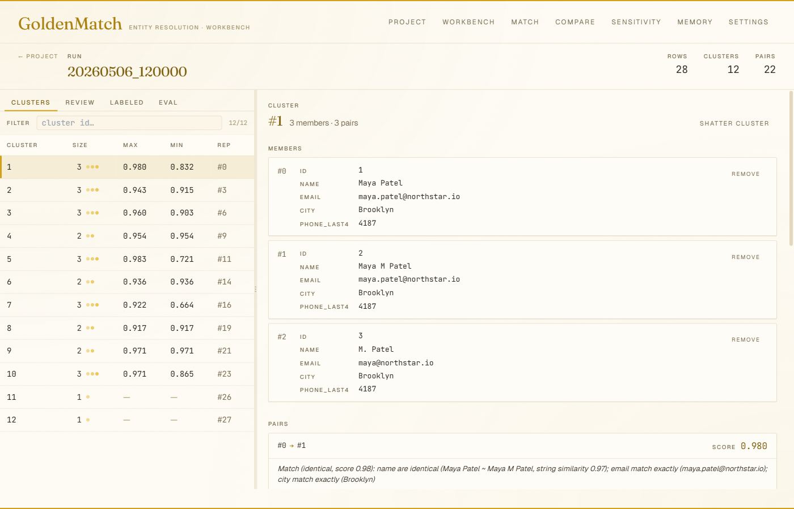
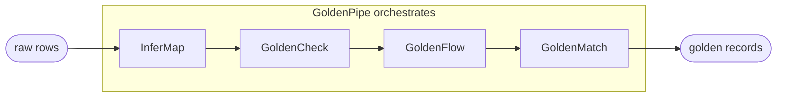

<!-- mcp-name: io.github.benzsevern/goldenmatch -->
<div align="center">

# 🟡 Golden Suite

**A polyglot data-quality and entity-resolution toolkit. Polished, opinionated, AI-native.**

*GoldenCheck profiles → GoldenFlow standardizes → GoldenMatch deduplicates → GoldenPipe orchestrates. With InferMap for schema mapping and a Rust extension layer for Postgres / DuckDB.*

<br>

<!-- Headline package: goldenmatch -->
[](https://pypi.org/project/goldenmatch/)
[](https://www.npmjs.com/package/goldenmatch)
[](https://python.org)
[](https://nodejs.org)
[](LICENSE)

<!-- Quality / proof -->
[](https://github.com/benzsevern/goldenmatch/actions/workflows/ci.yml)
[](https://codecov.io/gh/benzsevern/goldenmatch)
[](https://github.com/benzsevern/dqbench)
[](packages/python/goldenmatch/README.md#benchmarks)

<!-- Reach -->
[](https://pepy.tech/projects?q=goldenmatch+goldencheck+goldenpipe+goldenflow+infermap+goldencheck-types)
[](https://www.npmjs.com/~benzsevern)
[](https://github.com/benzsevern/goldenmatch/stargazers)

<!-- Ecosystem -->
[](https://bensevern.dev/)
[](https://github.com/benzsevern/goldenmatch/wiki)
[](https://github.com/benzsevern/goldenmatch/wiki/Web-UI)
[](https://smithery.ai/servers/benzsevern/goldenmatch)
[](https://colab.research.google.com/github/benzsevern/goldenmatch/blob/main/packages/python/goldenmatch/scripts/gpu_colab_notebook.ipynb)

<!-- Activity -->
[](https://github.com/benzsevern/goldenmatch/discussions)
[](https://github.com/benzsevern/goldenmatch/commits/main)

</div>

[](https://github.com/benzsevern/goldenmatch/wiki/Web-UI)

<p align="center"><sub><em>Pair drilldown in the web workbench: cluster members, field-level diff, and a one-line NL explanation per pair. <code>pip install goldenmatch[web]</code> then <code>goldenmatch serve-ui &lt;project&gt;</code>. <a href="https://github.com/benzsevern/goldenmatch/wiki/Web-UI">More screenshots →</a></em></sub></p>

```bash
# Headline package: dedupe a CSV in 30 seconds
pip install goldenmatch && goldenmatch dedupe customers.csv

# TypeScript / Edge runtimes
npm install goldenmatch
```

> **🆕 v1.7.0 (Python) — web workbench** — `pip install goldenmatch[web]` then `goldenmatch serve-ui <project>` opens a localhost browser workbench (FastAPI + React, editorial gold-on-cream theme). Edit matchkey / standardization / blocking rules with live Pydantic validation, run sampled previews, save back to `goldenmatch.yml`. Inspect saved runs (cluster table + pair drilldown + one-line NL prose explanations + F1/precision/recall vs steward labels). One-to-many `match` workflow, run-vs-run comparison (CCMS), parameter sensitivity sweeps, Learning Memory browser. Single-process, no auth — for dev-on-a-laptop. See [packages/python/goldenmatch/README.md#web-ui](packages/python/goldenmatch/README.md#web-ui).
>
> v1.6.0 (Python) + v0.4.0 (npm) — **cross-language Learning Memory parity**. A correction written by Python applies identically in TypeScript and vice versa: byte-identical SHA-256 hashes, the same SQLite schema, the same collision-safe re-anchor algorithm, verified every CI run by JSON + SQLite + apply-outcome parity tests on both sides. Steward decisions, unmerges, LLM votes, and agent approvals persist to a local store, re-anchor across row reorders via record-hash, and apply automatically on the next run. Each runtime ships its own CLI subgroup (`goldenmatch memory` / `goldenmatch-js memory`), MCP tools (35 Python / 24 TS), and programmatic API (`add_correction()` / `learn()` / `memory_stats()`). Off by default. See [Learning Memory docs](https://benzsevern.github.io/goldenmatch/learning-memory).
>
> v1.5.0 — auto-config preflight + postflight verification layer. Built by [Ben Severn](https://bensevern.dev).

---

## Why a suite?

Each tool stands alone, but they compose into a single pipeline:



| Step | Role |
|---|---|
| **InferMap** | schema mapping — auto-aligns columns across heterogeneous sources |
| **GoldenCheck** | profile + validate — encoding, format, anomaly detection |
| **GoldenFlow** | standardize + transform — phone, date, address, categorical normalization |
| **GoldenMatch** | dedupe + cluster + survivorship — fuzzy / exact / probabilistic / LLM |
| **GoldenPipe** | orchestrator — declarative YAML pipeline wiring the four steps |

- **Zero-config defaults that admit when they're unsure** — every step has a self-verifying preflight + postflight; results carry an inspectable report instead of failing silently.
- **97.2% F1 on DBLP-ACM out of the box** for entity resolution. [DQBench ER score: 95.30](https://github.com/benzsevern/dqbench).
- **Learning Memory** — corrections persist across runs and re-anchor across row reorders, so the system stops needing the same correction twice (GoldenMatch v1.6.0; off by default).
- **Privacy-preserving record linkage** — match across organizations without sharing raw data (PPRL, 92.4% F1 on FEBRL4).
- **AI-native by design** — every package ships an MCP server, a REST API, and an A2A agent surface. 35+ MCP tools across the suite.
- **Polyglot parity** — Python and TypeScript implementations track the same scorer outputs to 4-decimal precision via a parity harness.
- **Production paths** — Postgres sync, daemon mode, lineage tracking, review queues, dbt integration, GitHub Actions, and a Rust extension layer for Postgres / DuckDB.

---

## The Suite

| Package | Lang | What it does | Install |
|---|---|---|---|
| **[GoldenMatch](packages/python/goldenmatch/README.md)** 🟡 | Python · TS | Zero-config entity resolution. Fuzzy + exact + probabilistic + LLM. Headline package. | `pip install goldenmatch` · `npm i goldenmatch` |
| **[GoldenCheck](packages/python/goldencheck/README.md)** | Python · TS types | Data-quality scanning: encoding, Unicode, format validation, anomaly detection. | `pip install goldencheck` |
| **[GoldenFlow](packages/python/goldenflow/README.md)** | Python · TS | Transforms & standardizers: phone, date, address, categorical normalization. | `pip install goldenflow` |
| **[GoldenPipe](packages/python/goldenpipe/README.md)** | Python | Orchestrator that wires Check → Flow → Match into one declarative pipeline. | `pip install goldenpipe` |
| **[InferMap](packages/python/infermap/README.md)** | Python · TS | Schema mapping engine — auto-aligns columns across heterogeneous sources. | `pip install infermap` · `npm i infermap` |
| **[goldenmatch-extensions](packages/rust/extensions/README.md)** | Rust | Postgres extension (pgrx) + DuckDB UDFs. SQL-native fuzzy matching. | source build |
| **[dbt-goldencheck](packages/dbt/goldencheck/README.md)** | dbt | dbt package — data-quality tests for warehouse models. | dbt deps |
| **[goldencheck-action](packages/actions/goldencheck/README.md)** | YAML | GitHub Action — fail PRs that introduce data-quality regressions. | Marketplace |

> Headline pitch and the deepest docs live in **[packages/python/goldenmatch/README.md](packages/python/goldenmatch/README.md)** (910 lines, full feature list, CLI, architecture, benchmarks).

---

## Choose your path

| I want to... | Go here |
|---|---|
| Deduplicate a CSV right now | [`packages/python/goldenmatch`](packages/python/goldenmatch/README.md#quick-start) |
| Use from Claude Desktop / Code | [`packages/python/goldenmatch` — MCP](packages/python/goldenmatch/README.md#remote-mcp-server) |
| Edit rules in a browser, label pairs, compare runs | [`packages/python/goldenmatch` — Web UI](packages/python/goldenmatch/README.md#web-ui) |
| Build AI agents that deduplicate | [ER Agent / A2A wiki page](https://github.com/benzsevern/goldenmatch/wiki/ER-Agent) |
| Profile data quality before matching | [`packages/python/goldencheck`](packages/python/goldencheck/README.md) |
| Standardize messy fields (phone, date, address) | [`packages/python/goldenflow`](packages/python/goldenflow/README.md) |
| Run the full pipeline declaratively | [`packages/python/goldenpipe`](packages/python/goldenpipe/README.md) |
| Map columns across schemas | [`packages/python/infermap`](packages/python/infermap/README.md) |
| Write TypeScript / Node.js / Edge | [`packages/typescript/goldenmatch`](packages/typescript/goldenmatch/README.md) |
| Match in Postgres / DuckDB SQL | [`packages/rust/extensions`](packages/rust/extensions/README.md) |
| Add data-quality gates to dbt | [`packages/dbt/goldencheck`](packages/dbt/goldencheck/README.md) |
| Block bad data in GitHub PRs | [`packages/actions/goldencheck`](packages/actions/goldencheck/README.md) |
| Run as Airflow DAGs | [`examples/airflow/`](examples/airflow/README.md) — 12 drop-in DAGs |
| Run from a single MCP container | [`docker run ghcr.io/benzsevern/goldensuite-mcp:latest`](packages/python/goldensuite-mcp/README.md) |
| Pull every Suite container | [GitHub Packages](https://github.com/benzsevern?tab=packages) |

---

## Quick examples

### Python — dedupe in 30 seconds

```python
import goldenmatch as gm

# Zero-config
result = gm.dedupe("customers.csv")
print(result)  # DedupeResult(records=5000, clusters=847, match_rate=12.0%)
result.golden.write_csv("deduped.csv")

# Or be explicit
result = gm.dedupe("customers.csv",
    exact=["email"],
    fuzzy={"name": 0.85, "zip": 0.95},
    blocking=["zip"],
    threshold=0.85)
```

### TypeScript — edge-safe core

```typescript
import { dedupe } from "goldenmatch";

const result = dedupe(rows, {
  fuzzy: { name: 0.85 },
  blocking: ["zip"],
  threshold: 0.85,
});
console.log(result.stats);  // { totalRecords, totalClusters, matchRate, ... }
```

Runs in browsers, Vercel Edge, Cloudflare Workers, Deno. 478 tests, strict TypeScript (`noUncheckedIndexedAccess`, `exactOptionalPropertyTypes`).

### Web workbench — browser UI for matching

```bash
pip install 'goldenmatch[web]'
goldenmatch serve-ui my-project   # opens http://localhost:5050
```


Edit rules with live validation, preview against a sampled slice, label pairs
(mirrored into Learning Memory automatically), compare runs (CCMS), sweep
parameters, browse the corrections store. Single-process localhost workbench
shipped as the optional `[web]` extra.

### Composed pipeline

```python
import goldenpipe as gp

pipeline = gp.Pipeline.from_yaml("pipeline.yaml")  # check → flow → match
result = pipeline.run("customers.csv")
result.report.write_html("report.html")
```

**More**: [`examples/`](examples/README.md) has runnable demos for every Suite scenario:
[Python](examples/python/README.md) (quickstart, full pipeline, customer 360, PPRL, review workflow, MCP client) ·
[TypeScript](examples/typescript/README.md) (quickstart, Vercel Edge route, MCP client) ·
[Airflow DAGs](examples/airflow/README.md) (12 production-shaped pipelines).

---

## Install variants

GoldenMatch ships fat optional extras so you only pay for what you use:

```bash
pip install goldenmatch                    # core (CSV in, CSV out)
pip install goldenmatch[embeddings]        # + sentence-transformers, FAISS
pip install goldenmatch[llm]               # + Claude / OpenAI for LLM boost
pip install goldenmatch[postgres]          # + Postgres sync
pip install goldenmatch[snowflake]         # + Snowflake connector
pip install goldenmatch[bigquery]          # + BigQuery connector
pip install goldenmatch[databricks]        # + Databricks connector
pip install goldenmatch[salesforce]        # + Salesforce connector
pip install goldenmatch[duckdb]            # + DuckDB out-of-core backend
pip install goldenmatch[ray]               # + Ray distributed backend (50M+ rows)
pip install goldenmatch[quality]           # + GoldenCheck integration
pip install goldenmatch[transform]         # + GoldenFlow integration
pip install goldenmatch[mcp]               # + MCP server for Claude Desktop
pip install goldenmatch[agent]             # + A2A agent (aiohttp)
pip install goldenmatch[web]               # + localhost browser workbench (FastAPI + React)

goldenmatch setup    # interactive wizard: GPU, API keys, database
```

Sister packages compose: `pip install goldenpipe[full]` brings in Check + Flow + Match together.

---

## Remote MCP Server

GoldenMatch is hosted as an MCP server on [Smithery](https://smithery.ai/servers/benzsevern/goldenmatch) — connect from any MCP client without installing anything.

```json
{
  "mcpServers": {
    "goldenmatch": {
      "url": "https://goldenmatch-mcp-production.up.railway.app/mcp/"
    }
  }
}
```

35+ MCP tools across the suite: deduplicate, match, explain, review, link privately, configure, scan quality, transform, synthesize golden records, and manage Learning Memory corrections.

---

## Container images

Every Suite package ships as a multi-arch container image (linux/amd64 + linux/arm64) on GitHub Container Registry. Pull anonymously, no auth needed:

```bash
# One container, every Suite tool — the convenience option
docker run -p 8300:8300 ghcr.io/benzsevern/goldensuite-mcp:latest

# Per-package containers — narrower deployments
docker run -p 8200:8200 ghcr.io/benzsevern/goldenmatch-mcp:latest
docker run -p 8100:8100 ghcr.io/benzsevern/goldencheck-mcp:latest
docker run -p 8150:8150 ghcr.io/benzsevern/goldenflow-mcp:latest
docker run -p 8250:8250 ghcr.io/benzsevern/goldenpipe-mcp:latest
docker run -p 8400:8400 ghcr.io/benzsevern/infermap-mcp:latest

# Postgres + extension preinstalled
docker run -e POSTGRES_PASSWORD=secret ghcr.io/benzsevern/goldenmatch-extensions:latest
```

Tags:
- `:latest` — current `main`
- `:main-<sha7>` — every push to main, immutable
- `:vX.Y.Z` and `:vX.Y` — pushed when a `<package>-vX.Y.Z` tag is created

See [`packages/python/goldensuite-mcp/README.md`](packages/python/goldensuite-mcp/README.md) for the aggregator's tool-collision behaviour.

---

## Airflow

12 drop-in DAGs at [`examples/airflow/`](examples/airflow/README.md), grouped by lifecycle stage:

| Group | DAGs |
|---|---|
| **Core pipeline** | `daily_dedupe`, `incremental_match`, `warehouse_native` (Snowflake), `customer_360` (multi-source) |
| **Privacy** | `pprl_linkage` (two-party PPRL) |
| **Onboarding & monitoring** | `schema_align_and_load`, `schema_drift_alarm`, `quality_gate` |
| **Feedback loop** | `review_worker`, `active_learning` |
| **Operationalize** | `reverse_etl` (Salesforce/HubSpot), `backfill` |

TaskFlow API, Airflow 2.7+ (compatible with 3.x). Each DAG has tunable knobs at the top, idempotent retries, and is marker-protected against double-processing. Drop the file you want into your Airflow `dags/` folder.

---

## Repository layout

```
goldenmatch/
├── packages/
│   ├── python/
│   │   ├── goldenmatch/      # entity resolution — headline package
│   │   ├── goldencheck/      # data quality scanning
│   │   ├── goldenflow/       # transforms & standardizers
│   │   ├── goldenpipe/       # orchestrator
│   │   └── infermap/         # schema mapping
│   ├── typescript/
│   │   ├── goldenmatch/      # full TS port (edge-safe core)
│   │   ├── goldencheck/      # TS implementation
│   │   ├── goldencheck-types/ # shared TS types
│   │   ├── goldenflow/       # TS transforms
│   │   └── infermap/         # TS schema mapping
│   ├── rust/
│   │   └── extensions/       # Postgres pgrx + DuckDB UDFs (own Cargo workspace)
│   ├── python/goldensuite-mcp/ # aggregator MCP server (one container, all tools)
│   ├── dbt/goldencheck/      # dbt package
│   └── actions/goldencheck/  # GitHub Action
├── examples/
│   ├── python/               # 6 runnable Python scripts (quickstart → MCP)
│   ├── typescript/           # 3 TS scripts (quickstart, Vercel Edge, MCP)
│   └── airflow/              # 12 drop-in Airflow DAGs
├── docs/superpowers/         # design specs and implementation plans
├── justfile                  # install / test / lint / build, all languages
├── pyproject.toml            # uv workspace (root)
├── package.json              # per-package npm (Windows-symlink-safe; no root workspace)
└── .github/workflows/ci.yml
```

### Why no root Cargo or npm workspace?

- **Cargo:** `packages/rust/extensions/` is itself a Cargo workspace (the `postgres` crate is excluded for pgrx-specific build requirements). Cargo doesn't allow nested workspaces sharing members. Cargo commands run from inside `packages/rust/extensions/`.
- **npm:** A real npm workspace causes Windows symlink issues for some users. Each TypeScript package installs independently. The root `package.json` provides convenience scripts (`install:all`, `test:all`, `build:all`) but isn't a workspace.

### Build / test / lint everything

```bash
just install   # uv sync + per-package npm install + cargo fetch
just test      # all languages
just lint
just build
```

---

## Contributing

- Feature work goes on `feature/<name>` branches; merge via squash PR.
- PR title format: `feat: <description>`, `fix: <description>`, `docs: <description>`.
- Tests must pass on all three languages where the change applies; the parity harness in `packages/typescript/goldenmatch/tests/parity/` enforces 4-decimal-tolerance Python ↔ TypeScript scorer parity.
- See `docs/superpowers/specs/` for design rationale on architectural decisions.

### TypeScript dev setup (pnpm + Turborepo)

The TypeScript packages live in a single pnpm workspace orchestrated by Turborepo. From the repo root:

```bash
corepack enable                               # one-time, picks up pnpm@9.15.0 from package.json
pnpm install                                  # installs all workspace packages
pnpm turbo run build test typecheck lint      # full pipeline (cached after first run)
pnpm --filter goldenmatch test                # single package
```

**Windows: enable Developer Mode for pnpm.** `pnpm install` creates symlinks under `node_modules/`. Settings → For Developers → Developer Mode → On. If you see `EPERM: operation not permitted, symlink ...` during install, Dev Mode is off.

If `corepack enable` fails (often needs an admin shell on Windows), the fallback is `npm i -g pnpm@9.15.0` — functionally equivalent.

---

## History

This repository was formed on **2026-05-01** by folding 8 sibling repos into the existing `goldenmatch` repo using `git filter-repo`. Full commit history is preserved for every source. See [`docs/superpowers/specs/2026-05-01-goldenmatch-monorepo-fold-in-design.md`](docs/superpowers/specs/2026-05-01-goldenmatch-monorepo-fold-in-design.md) for the design rationale and [`docs/superpowers/plans/2026-05-01-goldenmatch-monorepo-fold-in.md`](docs/superpowers/plans/2026-05-01-goldenmatch-monorepo-fold-in.md) for the step-by-step migration plan.

---

## Author & License

Built by **[Ben Severn](https://bensevern.dev)**.

MIT — see [LICENSE](LICENSE).
