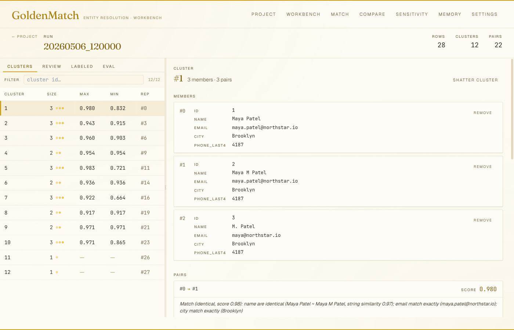
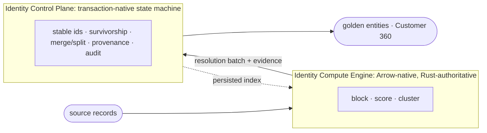
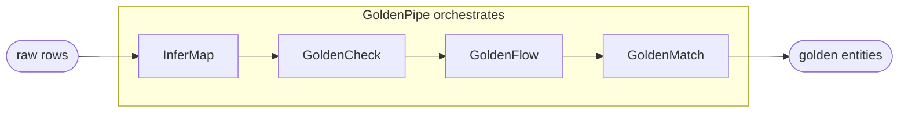

<!-- mcp-name: io.github.benseverndev-oss/goldenmatch -->
<div align="center">

# Golden Suite

Your customer data lives in a CRM, a billing system, and three spreadsheets nobody owns. Some records are duplicates. Some are the same company spelled four different ways. Nobody can answer *how many customers do we actually have*, and every dashboard built on top inherits the doubt.

**Splink-beating entity resolution, Arrow-native and Rust-fast with zero tuning, feeding a durable identity layer so messy records from every source become stable golden entities with whole-record, Customer-360 provenance.**

Zero-config matching that **beats expert-tuned Splink head-to-head on messy customer records**, in an **Arrow-native, Rust-authoritative** engine verified from a laptop CSV to a **100M-row dedupe in 9.2 minutes**. The identities it produces live in a **transaction-native control plane** carrying stable `entity_id`s, per-field provenance, merge/split, and a tamper-evident audit log, all one call away as a Customer 360. It even **owns its primitives**: byte-identical, faster-than-`rapidfuzz` / `jellyfish` / FAISS Rust kernels, not rented dependencies.

**Python · TypeScript · SQL, at 4-decimal parity · native in Postgres + DuckDB · edge WASM · 70+ MCP tools · beats hand-tuned Splink · 100M rows in 9.2 min**

<br>

<!-- Headline package: goldenmatch -->
[](https://pypi.org/project/goldenmatch/)
[](https://www.npmjs.com/package/goldenmatch)
[](https://python.org)
[](https://nodejs.org)
[](LICENSE)

<!-- Quality / proof -->
[](https://github.com/benseverndev-oss/goldenmatch/actions/workflows/ci.yml)
[](https://codecov.io/gh/benseverndev-oss/goldenmatch)
[](https://scorecard.dev/viewer/?uri=github.com/benseverndev-oss/goldenmatch)
[](docs/benchmarks/2026-06-09-splink-bakeoff.md)
[](packages/python/goldenmatch/README.md#benchmarks)

<!-- Reach -->
[](https://pepy.tech/projects?q=goldenmatch+goldencheck+goldenpipe+goldenflow+goldenanalysis+infermap+goldencheck-types+goldensuite-mcp+goldenfuzz+goldenphonetic+goldenmatch-hnsw+goldenmatch-duckdb+goldenmatch-native+goldenflow-native+goldencheck-native+goldenanalysis-native+goldengraph-native+goldenprofile-native+goldenpipe-native+infermap-native+goldenmatch-embed+goldengraph+goldenmatch-kg+golden-suite)
[](https://www.npmjs.com/~benzsevern)
[](https://crates.io/crates/goldenfuzz-core)
[](https://github.com/benseverndev-oss/goldenmatch/stargazers)

<!-- Ecosystem -->
[](https://docs.bensevern.dev/docs/)
[](https://github.com/benseverndev-oss/goldenmatch/wiki)
[](https://github.com/benseverndev-oss/goldenmatch/wiki/Web-UI)
[](https://smithery.ai/servers/benzsevern/goldenmatch)
[](https://github.com/benseverndev-oss/goldenmatch/commits/main)

</div>

[](https://github.com/benseverndev-oss/goldenmatch/wiki/Web-UI)

<p align="center"><sub><em>Pair drilldown in the web workbench: cluster members, field-level diff, and a one-line NL explanation per pair. <code>pip install goldenmatch[web]</code> then <code>goldenmatch serve-ui &lt;project&gt;</code>. <a href="https://github.com/benseverndev-oss/goldenmatch/wiki/Web-UI">More screenshots →</a></em></sub></p>

<!-- README-callouts:start  (auto-synced from packages/python/goldenmatch/CHANGELOG.md by scripts/sync_readme_callouts.py; edit the CHANGELOG, not this block) -->
> **v3.13.0: Fellegi-Sunter training runs distributed on Spark.** The E-step reads only the
comparison vector, so identical vectors collapse to one counted row and the whole
step becomes a Spark `GROUP BY` over agreement patterns -- the cluster counts, the
driver only fits. Training cost tracks DISTINCT vectors (bounded by
`prod(levels + 1)`), not pairs: 1M -> 5M rows grew candidate pairs 5.00x and the
distributed counting stage 5.25x, while distinct patterns grew 3.0% (433 -> 446)
and driver-side EM stayed at 0.01s. Runs on jar-only executors via
`goldenmatch-spark`, off the same Rust kernel every other surface uses.
>
> **v3.12.0: Semantic-model discovery reaches warehouse scale.** Model derivation now runs
off `information_schema` instead of a sampled frame, plus catalog reconciliation
and a real-LLM namer validation harness -- so a warehouse's existing model can be
discovered, reconciled against what is really there, and named without hand
curation.
>
> **v3.11.0: Customer 360 serving surface, and a fused FS kernel that covers the
reference-data name scorers.** `customer_360` composes the golden record,
per-field provenance, linked source records, the event timeline and the
relationship neighborhood into one read, with semantic-layer drill-through; the
fused Fellegi-Sunter kernel now covers the reference-data name scorers and an
in-RAM sequential Arrow-native batch scorer with end-WCC.
<!-- README-callouts:end -->

---

## What you get: the golden entity

Most entity-resolution tools hand you clusters and stop. GoldenMatch keeps going: it resolves messy records into a **durable golden entity**, one per real-world customer, that survives re-runs, carries provenance on *every field*, and answers "who is this, and where did each value come from?" in a single call.

- **A stable identity, not a throwaway cluster id.** Every entity gets a stable `entity_id` (UUIDv7) that persists across runs as new data arrives. Records are absorbed, entities merge or split, but the id an entity earns is the id downstream systems can rely on. Run-local cluster numbers reshuffle on every run; these don't.
- **Whole-record provenance.** Every field of the golden record traces back to the source record that won it: which source, when it was last seen, and which survivorship strategy picked it. The values it *didn't* pick stay visible rather than being silently dropped. Provenance is on the whole unified record, not just the match decision.
- **Governed by construction.** Conflicting values collapse to one best value by an explicit survivorship policy (most-complete · source-priority · most-recent · majority-vote); every identity change lands in an **append-only event timeline**; and the log is sealed with a **hash-chained, tamper-evident audit** that a reviewer (or the other language port) can independently verify.

`customer_360(entity_id)` composes it into one read: golden record, per-field provenance, every linked source record, the event timeline, and the entity's relationship neighborhood:

```jsonc
// customer_360("018f...c2a1")  (trimmed)
{
  "entity_id": "018f2b7e-...-c2a1", "confidence": 0.97, "record_count": 3,
  "sources": ["salesforce", "billing", "support"],
  "golden_record": { "name": "Ada Lovelace", "email": "ada@analytical.io", "phone": "+1-555-0100" },
  "field_provenance": [
    { "field": "email", "value": "ada@analytical.io",
      "winning_source": "billing", "winning_record_id": "billing:8821",
      "conflicting_values": [ { "value": "ada@ada.dev", "source": "salesforce" } ] },
    { "field": "phone", "value": "+1-555-0100", "winning_source": "salesforce" }
  ],
  "timeline": [ { "kind": "created", "actor": "pipeline", "recorded_at": "2026-07-30T..." },
                { "kind": "absorbed_record", "reason": "matched billing:8821" } ],
  "relationships": [ { "other_entity_id": "018f...9d0e", "kind": "shares_address" } ]
}
```

> **What ships today vs. what's emerging.** The **identity spine is production-grade and in `main`**: stable `entity_id`s, per-field provenance, survivorship, merge/split, the append-only log + audit chain, cross-channel stitching, the relationship overlay, and **incremental resolution** against a persisted index (a new record resolves without a full re-run). The **`customer_360()` serving view** above and the **source-registry** layer that keeps it fresh from live systems are the newer, actively-landing pieces. The source connectors (Snowflake, BigQuery, Salesforce, HubSpot) ship today; the registry that wires them into the spine is emerging. See [the Customer 360 design + ADR](context-network/architecture/customer-360-data-connection.md). We label the seam rather than blur it.

The golden entity lives in the **control plane**; the matching that builds it runs in the **compute engine**. That split is the next section.

---

## One product, two engines

The golden entity above is produced by two engines that optimize for genuinely different things, and keeping them distinct is the architecture, not an implementation detail ([ADR 0047](context-network/decisions/0047-one-product-two-engines-architecture.md)).


```mermaid
flowchart LR
    src([source records])
    e360([golden entities · Customer 360])
    subgraph compute ["Identity Compute Engine: Arrow-native, Rust-authoritative"]
        match[block · score · cluster]
    end
    subgraph control ["Identity Control Plane: transaction-native state machine"]
        spine[stable ids · survivorship · merge/split · provenance · audit]
    end
    src --> compute -->|resolution batch + evidence| control --> e360
    control -.->|persisted index| compute
```

| | Identity Compute Engine | Identity Control Plane |
|---|---|---|
| **Shape** | Arrow at bulk boundaries, Rust-authoritative kernels | Transaction-native state machine (SQLite default · Postgres) |
| **Job** | Block, score, cluster: throughput, vectorized, deterministic per run | Stable ids, survivorship, merge/split, provenance, append-only audit |
| **State** | Stateless per call; measurement-driven kernelization | Durable, transactional, replayable, auditable |
| **Backends** | DataFusion · Ray · Sail · Spark are *replaceable* execution backends, none synonymous with GoldenMatch | Storage backends conform to one externally-observable semantics |

**Many surfaces, one answer.** The same capabilities reach Python, edge-safe TypeScript (with an opt-in WASM backend running the *same* Rust kernels), SQL inside PostgreSQL and DuckDB, and MCP / REST / A2A, all governed by **specification + conformance**, not copy-paste. There is one authoritative owner per capability; pure-Python / standalone-TS paths are classified, conformance-tested fallbacks. Where a boundary can't cross byte-for-byte, we [measure and label it](#cross-language-parity) rather than claim parity.

**Why a platform engineer should care:**

- **The compute layer isn't framework lock-in.** It's Arrow-native and backend-replaceable, so you can push the heavy matching to a query engine that plans, spills, and distributes (verified to 100M rows) without the identity state coming along for the ride.
- **The identity layer is a real state machine**, not a columnar rebuild-every-time batch. Durable ids, transactional merge/split, provenance and audit are first-class operations you can integrate against.
- **Behavior is consistent where it's shared.** SQL, Python, and TypeScript track the same answers to a conformance spec, so the surface you build on isn't quietly inventing its own semantics.

---

## Resolution that beats the expert

The identity layer is only as good as the matching underneath it, and the matching starts at zero config. `dedupe_df(df)` runs with no rules and no training data: it profiles the data, picks a defensible configuration, and returns golden records immediately. The config it chose comes back on `result.config`: inspectable, diffable, versionable. Never a black box.

- **Beats the expert, out of the box.** On messy customer records, the opt-in Fellegi-Sunter engine beats hand-tuned Splink head-to-head, with `historical_50k` pairwise F1 **0.827 vs 0.757**, cluster B³ **0.862 vs 0.788**, one shared evaluator, [reproducible bake-off](docs/benchmarks/2026-06-09-splink-bakeoff.md). Fuzzy, exact, probabilistic (Fellegi-Sunter), and LLM scorers, with EM-trained weights and calibrated scores.
- **A healing loop, not a one-shot.** Zero-config gets you most of the way; then every run checks a free unsupervised signal and, when there's headroom, attaches **ranked, self-verified config tweaks** to `result.suggestions`. Each is kept only if it doesn't worsen a health proxy, so a suggestion never makes results worse. `dedupe_df(df, heal=True)` applies and re-runs in one call. You close the gap to expert-tuned without being the expert.
- **Privacy-preserving record linkage.** Match across organizations without sharing raw data: Bloom-filter PPRL, **92.4% F1 on FEBRL4**, with HMAC-salted encodings.
- **Self-verifying.** Every step runs preflight + postflight checks and returns an inspectable report instead of failing silently. That is the "advanced, never black-box" contract that makes an automated identity layer safe to build on.

> Runs on **unstructured input**, too: extract records from PDFs and images, then resolve them like any other source (`pip install goldenmatch[documents]`).

---

## Runs where your stack is

The engine and the identity layer reach your stack through the surface you already use, with the *same* capabilities governed by conformance ([one product, two engines](#one-product-two-engines)) rather than re-implemented thinly per surface.

- **SQL-native, at parity.** The same functions run inside **PostgreSQL** (pgrx extension) and **DuckDB**: dedupe · match · score · auto-config + telemetry · identity-graph reads · profiling · `evaluate` · Fellegi-Sunter scoring · GoldenFlow transforms. Resolve without moving data out of the warehouse.
- **Python and edge-safe TypeScript.** The full suite ships on **npm** alongside PyPI. The TS cores are dependency-free and `node:*`-free (browsers, Cloudflare Workers, Vercel Edge, Deno); an opt-in WebAssembly backend (`await enableWasm()`) swaps in the *same* pyo3-free Rust kernels the Python wheels and SQL UDFs use, with pure-TS as the byte-identical default.
- **AI-native by default.** Every package ships an MCP server, a REST API, and an A2A agent surface (70+ MCP tools across the suite), all exposing the *same* JSON telemetry shape across web, TUI, CLI, Postgres, DuckDB, and MCP.
- **Spark, with no Python on the executors.** The Rust kernels ride into a Spark cluster in one jar (`spark.addArtifact("goldenmatch-spark.jar")`) and are called over JNI, so executors need no goldenmatch virtualenv, no packed env, nothing installed. **Fellegi-Sunter training runs distributed on that path** -- the E-step is a Spark `GROUP BY` over agreement patterns, so the cluster does the counting and the driver only fits the model. Deployment story, not a throughput one: the JVM scoring path measured ~2.4x *slower* than the Python-worker path, and the reason to use it is that there is nothing to install.
- **Pipeline-native.** A dbt package (dedupe/match materializations, quality tests, identity-graph reads), a GitHub Action (fail PRs on data-quality regressions), and 13 drop-in Airflow DAGs ([Deploy](#deploy)).
- **Production paths.** Postgres sync, daemon mode, lineage tracking, review queues.

### Cross-language parity

Surface parity is *not* the same as handing any pipeline phase from one language to the other byte-for-byte. Each verdict below is **measured** by a conformance harness, not assumed:

| Boundary | Verdict |
| --- | --- |
| **Identity graph DB** | ✅ byte-safe + cryptographically cross-verifiable (a seal written by one toolkit validates under the other) |
| **`score → cluster`** and the end-to-end split-run | ✅ byte-safe, reproduces the single-language run |
| Cluster JSON · config YAML · Learning Memory · `record_fingerprint` | ✅ portable |
| **String scoring** | 🟡 4-decimal tolerance; a pair on a threshold can flip (byte-identical only with the shared WASM scorer) |
| **Standardize / dates** · embeddings · auto-config controller | 🟠 divergent, not byte-portable |
| Distributed / Ray · document (VLM) ingest | ⛔ Python-only by architecture |

**Rule of thumb:** hand off at the **cluster** or **identity** boundary and it's seamless; don't split across `standardize`/dates, embeddings, or the controller and expect bit-exact reproduction. Full detail + the runnable harness that keeps these verdicts honest: [Cross-language parity & phase-handoff limits](https://docs.bensevern.dev/docs/concepts/cross-language-parity).

---

## The suite: the pipeline into the spine

GoldenMatch is the headline, but resolution is only as good as what feeds it. Five sibling tools clean, standardize, and map records *before* they reach the identity layer. Each stands alone, but they compose into one pipeline, orchestrated declaratively by GoldenPipe:


```mermaid
flowchart LR
    raw([raw rows])
    golden([golden entities])
    subgraph orchestration ["GoldenPipe orchestrates"]
        direction LR
        infermap[InferMap] --> goldencheck[GoldenCheck] --> goldenflow[GoldenFlow] --> goldenmatch[GoldenMatch]
    end
    raw --> infermap
    goldenmatch --> golden
```

| Package | Lang | Role in the pipeline | Install |
|---|---|---|---|
| **[InferMap](packages/python/infermap/README.md)** | Python · TS | Schema mapping: auto-aligns columns across heterogeneous sources | `pip install infermap` · `npm i infermap` |
| **[GoldenCheck](packages/python/goldencheck/README.md)** | Python · TS | Data-quality scanning: encoding, format validation, anomaly detection | `pip install goldencheck` · `npm i goldencheck` |
| **[GoldenFlow](packages/python/goldenflow/README.md)** | Python · TS | Transforms & standardizers: phone, date, address, categorical | `pip install goldenflow` · `npm i goldenflow` |
| **[GoldenMatch](packages/python/goldenmatch/README.md)** | Python · TS | Zero-config entity resolution → the identity spine. **Headline package.** | `pip install goldenmatch` · `npm i goldenmatch` |
| **[GoldenAnalysis](packages/python/goldenanalysis/README.md)** | Python · TS | Analysis & reporting: any stage's artifacts → a unified `AnalysisReport` + cross-run regression detection | `pip install goldenanalysis` · `npm i goldenanalysis` |
| **[GoldenPipe](packages/python/goldenpipe/README.md)** | Python · TS | Orchestrator: declarative YAML wiring the steps | `pip install goldenpipe` · `npm i goldenpipe` |
| **[golden-suite](packages/python/golden-suite/README.md)** | Python | One-line meta-install: the whole suite + native acceleration | `pip install golden-suite` |

> The deepest docs live in **[packages/python/goldenmatch/README.md](packages/python/goldenmatch/README.md)** (~1,300 lines: full feature list, CLI, architecture, benchmarks).

### Owned libraries (standalone)

The suite owns its string-matching primitives instead of renting them: byte-identical drop-in replacements, published on their own so they're usable outside the suite too.

| Library | Replaces | What it is | Install |
|---|---|---|---|
| **[goldenfuzz](packages/rust/extensions/goldenfuzz-py/README.md)** | `rapidfuzz` | Fuzzy-string scorers + the full `fuzz.*` composite family + one-vs-many `extract`/`cdist`. Byte-identical (oracle-fuzzed), faster on short strings. | `pip install goldenfuzz` · `cargo add goldenfuzz-core` |
| **[goldenphonetic](packages/rust/extensions/goldenphonetic-py/README.md)** | `jellyfish` | Phonetic encoders: soundex / metaphone / nysiis / match-rating. Byte-identical (6,000-input + 2,500-pair fuzz corpus), pure-Rust zero-dep. | `pip install goldenphonetic` · `cargo add goldenphonetic-core` |
| **[goldenmatch-hnsw](packages/rust/extensions/hnsw-py/README.md)** | FAISS `IndexHNSWFlat` | Pure-Rust HNSW approximate-nearest-neighbor index (zero C deps). Powers embedding-based blocking across Python, Rust, and TS/WASM. | `pip install goldenmatch-hnsw` |

### Knowledge graphs

Entity resolution is the stage most GraphRAG pipelines do worst: duplicate surface forms of one entity scatter across documents. Two packages put GoldenMatch's resolution there:

| Package | What it does | Status |
|---|---|---|
| **[goldenmatch-kg](packages/python/goldenmatch-kg/README.md)** | Drop-in GoldenMatch resolution as the ER stage of existing KG frameworks (neo4j-graphrag, LlamaIndex, Graphiti). | in-repo · not published (by design) |
| **[goldengraph](packages/python/goldengraph/README.md)** | Build-your-own-KG from text: `text → LLM extraction → GoldenMatch resolution → durable bi-temporal store`. Rust engine; ER is the differentiator. | in-repo · first PyPI release pending |

**Measured, not asserted** ([ER-KG-Bench](packages/python/goldenmatch/benchmarks/er-kg-bench)): resolution scores **F1 0.602** on the labelled set, ahead of Neo4j-KGBuilder (0.456), neo4j-graphrag (0.403), and MS-GraphRAG / LightRAG / Cognee / mem0 (0.066). A resolved graph also does two things passage-window RAG structurally can't: **exact aggregation** (size-invariant where RAG recall collapses `0.99 → 0.64` across cluster-size buckets) and **temporal as-of** (`1.000` vs `0.002` on past-date queries).

---

## Scale & benchmarks

Every headline number maps back to a single committed runner (`scripts/run_benchmarks.py`); see [`docs/reproducing-benchmarks.md`](docs/reproducing-benchmarks.md) for per-number commands, dataset URLs, and expected output with tolerance.

- **Accuracy on customer-shaped data.** NC Voter **0.9719** F1 (real-data sample), Febrl3 **0.9912** F1; the opt-in Fellegi-Sunter path beats hand-tuned Splink head-to-head on every dataset Splink scores ([bake-off](docs/benchmarks/2026-06-09-splink-bakeoff.md)). (Bibliographic DBLP-ACM lands **96.4%** F1 for the record-linkage crowd, but customer identity is the focus.)
- **Privacy-preserving.** PPRL **92.4%** F1 on FEBRL4, matching across parties with no shared raw data.
- **Scale envelope** ([`docs/scale-envelope.md`](docs/scale-envelope.md)): per-backend ranges (in-memory/bucket to a few M · DuckDB out-of-core to ~50M · Ray distributed ≥ 50M), block-size failure modes, and a decision tree for picking a backend.

**Verified at the top end:** a full **100M-row** dedupe on a 5-node Ray cluster in **9.2 min** (554 s), **20,000,000 golden records recovered exactly**, driver peak **0.36 GB RSS**. The default distributed path is **recall-complete**: duplicates merge correctly *no matter how the input is partitioned* (blocking-key shuffle scoring + distributed randomized-contraction WCC), and it stays driver-collect-free end to end. Recipe: [`configs/distributed-100m.yaml`](packages/python/goldenmatch/configs/distributed-100m.yaml).

**Fellegi-Sunter training, distributed on Spark:** the E-step collapses to one Spark `GROUP BY` over agreement patterns, so training cost tracks the number of DISTINCT comparison vectors (bounded by `prod(levels + 1)`), not the pair count. Measured on a real 2-worker Spark cluster (jar-only executors, no Python installed), 1M -> 5M rows: candidate pairs grew **5.00x** and the distributed counting stage **5.25x**, while distinct patterns grew **3.0%** (433 -> 446) and driver-side EM stayed at **0.01s**. That is the property the tier rests on -- the cluster absorbs the data, the driver's work stays flat.

**Head-to-head vs Splink on a real Spark cluster, at 50M rows.** Both engines on the *same* 5-node cluster, the same fixture, the same shared metric implementation, and Splink configured the way its own performance guide prescribes -- `break_lineage_method="parquet"` onto a real distributed filesystem, shuffle partitions at 5x cluster cores, and identical 48 GB executors. Over **463,923,179 candidate pairs**, scored identically by both:

| | GoldenMatch | Splink | ratio |
| --- | ---: | ---: | ---: |
| wall | **552s** | 1,054s | 1.91x |
| u / estimate | **3.5s** | 30.8s | 8.78x |
| shuffle write | **86.8 GB** | 212.1 GB | 2.44x |
| stages | **119** | 394 | 3.31x |
| executor CPU | **31,300s** | 51,572s | 1.65x |

Reported with it, because a benchmark that only publishes its wins is not evidence: the margin still **narrows with scale** (2.54x at 1M -> 1.91x at 50M), single runs on this lane move **~16%** so no one ratio should carry much weight, **zero spill is scale-bounded** (true at 50M, but GoldenMatch spills 56.4 GB at 100M and 201.3 GB at 250M), the fixture is **synthetic**, and the accuracy figures in it are *not* an accuracy verdict -- for that, see the [bake-off](docs/benchmarks/2026-06-09-splink-bakeoff.md). **Measured further since:** **250M rows / 2.32 billion pairs in 670s** on the same 5-node cluster, no executor deaths and zero failed tasks, at **0.289 seconds per million pairs** -- 4.13x faster than the 2,766s that curve first measured, with 3.1x less executor CPU, zero spill and a byte-identical trained model. Cost stays linear in PAIRS rather than rows; the constant got four times smaller. Four earlier attempts at this comparison were invalid because *we* had misconfigured Splink; each defect and its effect is documented alongside the results. [Full method, caveats and reproduce command](docs/benchmarks/2026-08-19-spark-50m-head-to-head.md).

Three reproducible real-world pipelines run this on public data at scale:

- **[shell-company-network](https://github.com/benseverndev-oss/goldenmatch-shell-company-network)**: investigative ER across ICIJ Offshore Leaks + OpenSanctions + GLEIF + UK PSC. **−62.5% analyst-hours to triage** vs single-source baselines.
- **[vuln-attribution](https://github.com/benseverndev-oss/goldenmatch-vuln-attribution)**: **6,126,895 OSS-vulnerability records → 847,475 canonical vulns** across 40 sources in ~5 minutes on one 64GB runner.
- **[sanctions-reconciliation](https://github.com/benseverndev-oss/goldenmatch-sanctions-reconciliation)**: cross-list coverage on 85 public sanctions lists across 50+ jurisdictions.

---

## Install & quick start

**Dedupe a CSV in 30 seconds**, zero config, writes `<timestamp>_golden.csv`:

```bash
pip install goldenmatch && goldenmatch dedupe customers.csv
```

```python
import goldenmatch as gm

result = gm.dedupe("customers.csv")               # zero-config
print(result)                                     # DedupeResult(records=5000, clusters=847, match_rate=12.0%)
result.golden.write_csv("deduped.csv")

result = gm.dedupe("customers.csv",               # or be explicit
    exact=["email"], fuzzy={"name": 0.85, "zip": 0.95}, blocking=["zip"], threshold=0.85)
```

```typescript
import { dedupe } from "goldenmatch";           // edge-safe: browsers, Vercel Edge, Workers, Deno
const result = dedupe(rows, { fuzzy: { name: 0.85 }, blocking: ["zip"], threshold: 0.85 });
```

**The whole suite, configured for speed.** [`golden-suite`](packages/python/golden-suite/README.md) pulls in every package plus the native (Rust) kernels, pinned and defaulted to the perf-optimized config. Native wheels are **hard** dependencies on purpose: a platform without a wheel fails loudly rather than silently running the slow pure-Python path.

```bash
pip install golden-suite
golden-suite doctor        # verify every package + native kernel is importable and healthy
golden-suite optimize      # repair / re-enable the perf-optimized config

pip install golden-suite[mcp]     # + aggregator MCP server (every tool, one endpoint)
pip install golden-suite[all]     # everything
```

**Just GoldenMatch.** Fat optional extras, so you pay only for what you use (native acceleration is default on common platforms):

```bash
pip install goldenmatch                    # core (CSV in, CSV out) + native
pip install goldenmatch[documents]         # + PDF/image ingest (resolve unstructured input)
pip install goldenmatch[embeddings]        # + sentence-transformers, FAISS
pip install goldenmatch[llm]               # + Claude / OpenAI for LLM boost
pip install goldenmatch[ray]               # + Ray distributed backend (50M+ rows)
pip install goldenmatch[postgres]          # + Postgres sync  (also: [snowflake] [bigquery] [databricks] [salesforce])
pip install goldenmatch[mcp]               # + MCP server     (also: [agent] A2A, [web] browser workbench)
```

**Web workbench.** `pip install 'goldenmatch[web]'` then `goldenmatch serve-ui my-project` (opens `http://localhost:5050`): edit rules with live validation, preview against a sampled slice, label pairs (mirrored into Learning Memory), compare runs.

**More:** [`examples/`](examples/README.md), covering [Python](examples/python/README.md) (quickstart, full pipeline, customer 360, PPRL, MCP client) · [TypeScript](examples/typescript/README.md) (quickstart, Vercel Edge, MCP client) · [Airflow](examples/airflow/README.md).

---

## Deploy

**Remote MCP.** The hosted endpoint requires a bearer token -- it exposes tools that read and write files on the server, so it is not open. Ask the maintainer for one, or self-host: `goldenmatch mcp-serve --transport http` is the same server.

```json
{ "mcpServers": { "goldenmatch": {
    "url": "https://goldenmatch-mcp-production.up.railway.app/mcp/",
    "headers": { "Authorization": "Bearer YOUR_TOKEN" }
} } }
```

Self-hosting on loopback needs no token; binding to a public interface without
`GOLDENMATCH_MCP_TOKEN` is refused rather than served open.

**Containers.** Every package ships as a multi-arch image (linux/amd64 + arm64) on GHCR, pull anonymously:

```bash
docker run -p 8300:8300 ghcr.io/benseverndev-oss/goldensuite-mcp:latest   # one container, every tool
docker run -p 8200:8200 ghcr.io/benseverndev-oss/goldenmatch-mcp:latest   # per-package (also goldencheck/goldenflow/goldenpipe/infermap)
docker run -e POSTGRES_PASSWORD=secret ghcr.io/benseverndev-oss/goldenmatch-extensions:latest   # Postgres + extension
```

**Airflow.** 13 drop-in DAGs at [`examples/airflow/`](examples/airflow/README.md) (TaskFlow API, Airflow 2.7+ / 3.x; idempotent, marker-protected), grouped by lifecycle stage:

| Group | DAGs |
|---|---|
| **Core pipeline** | `daily_dedupe`, `incremental_match`, `warehouse_native` (Snowflake), `customer_360`, `identity_graph` |
| **Privacy** | `pprl_linkage` (two-party PPRL) |
| **Onboarding & monitoring** | `schema_align_and_load`, `schema_drift_alarm`, `quality_gate` |
| **Feedback loop** | `review_worker`, `active_learning` |
| **Operationalize** | `reverse_etl` (Salesforce/HubSpot), `backfill` |

---

## Repository layout

```
goldenmatch/
├── packages/
│   ├── python/        goldenmatch · goldencheck · goldenflow · goldenpipe · infermap · goldenanalysis
│   │                  goldensuite-mcp (aggregator) · golden-suite (meta) · goldengraph · goldenmatch-kg
│   ├── typescript/    full TS ports (edge-safe cores + WASM) · goldencheck-types
│   ├── rust/extensions/  Postgres pgrx + DuckDB UDFs + native kernels + owned libraries (own Cargo workspace)
│   ├── dbt/goldensuite/  dbt materializations, tests, macros
│   └── actions/goldencheck/  GitHub Action
├── examples/          python · typescript · airflow (drop-in DAGs)
├── context-network/   architecture decisions + design docs (ADRs, the two-engine frame, Customer 360)
├── docs/superpowers/  design specs and implementation plans
└── justfile · pyproject.toml (uv workspace) · pnpm-workspace.yaml (Turborepo) · .github/workflows/ci.yml
```

- **Cargo: no root workspace.** `packages/rust/extensions/` is itself a Cargo workspace (the `postgres` crate is excluded for pgrx); Cargo commands run from inside it.
- **TypeScript: one pnpm workspace.** `packages/typescript/*` form a single pnpm + Turborepo workspace.

```bash
just install   # uv sync + per-package npm install + cargo fetch
just test      # all languages   ·   just lint   ·   just build
```

## Contributing

- Feature work on `feature/<name>` branches; merge via squash PR. Titles: `feat:` / `fix:` / `docs:`.
- Tests must pass on all three languages where the change applies; the parity harness in `packages/typescript/goldenmatch/tests/parity/` enforces 4-decimal Python ↔ TypeScript scorer parity.
- Architecture changes conform to (or amend) the [one-product-two-engines frame](context-network/architecture/one-product-two-engines.md) in the same PR. Design rationale lives in `context-network/decisions/` and `docs/superpowers/specs/`.

```bash
corepack enable                               # one-time, picks up pnpm@9.15.0
pnpm install
pnpm turbo run build test typecheck           # full pipeline (cached after first run)
```

**Windows:** enable Developer Mode so `pnpm install` can create symlinks; if `corepack enable` needs admin, `npm i -g pnpm@9.15.0` is equivalent.

---

<sub>This repo was formed on **2026-05-01** by folding 8 sibling repos into `goldenmatch` via `git filter-repo` (full history preserved). Built by **[Ben Severn](https://bensevern.dev)**. MIT, see [LICENSE](LICENSE).</sub>
