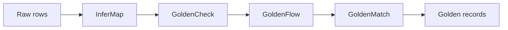

The Golden Suite is built so each tool stands alone but composes into a single pipeline. You can pick just the piece you need, or run the full chain end to end.

## The pipeline flow



<Steps>
  <Step title="InferMap aligns schemas">
    Auto-maps messy source columns to a known target schema with confidence scores and human-readable reasoning.
  </Step>
  <Step title="GoldenCheck profiles and validates">
    Discovers quality rules from the data itself: encoding, format, nullability, anomalies.
  </Step>
  <Step title="GoldenFlow standardizes">
    Normalizes phone numbers, dates, addresses, and categorical spelling with 76 built-in transforms.
  </Step>
  <Step title="GoldenMatch deduplicates">
    Blocks, scores, clusters, and synthesizes golden records using fuzzy, exact, probabilistic, and LLM scoring.
  </Step>
  <Step title="GoldenPipe orchestrates">
    Runs the whole chain with adaptive logic. It skips transformation if no issues are found and explains every decision.
  </Step>
</Steps>

## Polyglot by design

The same engine is implemented across languages so you can run it wherever your data lives.

| Surface | What it covers |
|---------|----------------|
| Python | Headline runtime. Full feature set, `pip install`, native Postgres and DuckDB support. |
| TypeScript | Parity core. Edge-safe (Vercel Edge, Cloudflare Workers, Deno). Matches Python scorer outputs to four decimals. |
| Rust | Postgres extension (pgrx) and DuckDB UDFs for SQL-native matching. |
| dbt | `dbt-goldencheck` data-quality tests as a dbt package. |
| GitHub Actions | `goldencheck-action` gates pull requests on data-quality regressions. |

## AI-native surface

Every package ships an MCP server, a REST API, and an agent surface. Across the suite there are 35+ MCP tools. The `AutoConfigController` is visible from every interface: the web `ControllerPanel`, the TUI (`Ctrl+A`), the CLI, REST endpoints, Postgres functions, DuckDB UDFs, and MCP/agent tools.

Add the remote MCP server to Claude Desktop or Claude Code:

```json
{
  "mcpServers": {
    "goldenmatch": {
      "url": "https://goldenmatch-mcp-production.up.railway.app/mcp/"
    }
  }
}
```

## Repository layout

The suite is a single monorepo:

```text
packages/
├── python/       goldenmatch, goldencheck, goldenflow, goldenpipe, infermap, goldensuite-mcp
├── typescript/   goldenmatch, goldencheck, goldenflow, infermap
├── rust/         extensions (Postgres pgrx + DuckDB UDFs)
├── dbt/          dbt-goldencheck
└── actions/      goldencheck GitHub Action
examples/         Python, TypeScript, and Airflow DAG demos
```

## Production paths

- Postgres sync and daemon mode for continuous deduplication.
- Review queues for human-in-the-loop correction.
- dbt integration for warehouse-native pipelines.
- GitHub Actions for pull-request data-quality gates.
- Airflow DAGs (drop-in examples, TaskFlow API, Airflow 2.7+).
- The Rust extension layer for matching directly inside Postgres or DuckDB.
