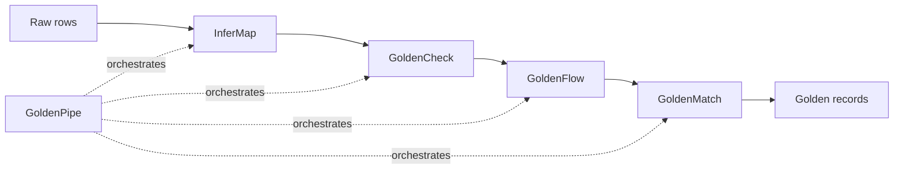

The Golden Suite is a polyglot data-quality and entity-resolution toolkit. Each tool stands alone, but together they form a single pipeline: profile your data, standardize it, deduplicate it, and emit golden records. Every package ships zero-config defaults, a CLI, a Python and a TypeScript library, and an AI-native surface (MCP server, and — for the service-shaped packages — a REST API and agent skills).

## Start where you fit

<CardGroup cols={3}>
  <Card title="Developers" icon="code" href="/quickstart">
    Install and dedupe a CSV in 30 seconds from Python, TypeScript, or the CLI.
  </Card>
  <Card title="No code" icon="window-maximize" href="/web-ui">
    Point-and-click in the browser workbench — edit rules, review matches, label pairs.
  </Card>
  <Card title="Researchers" icon="flask" href="/for-researchers">
    Reproduce the benchmarks, read the methodology + honest framing, and cite the work.
  </Card>
</CardGroup>

<CardGroup cols={2}>
  <Card title="Quickstart" icon="rocket" href="/quickstart">
    Deduplicate a CSV in 30 seconds.
  </Card>
  <Card title="Architecture" icon="diagram-project" href="/concepts/architecture">
    How the six tools compose into one pipeline.
  </Card>
  <Card title="GoldenMatch" icon="object-group" href="/goldenmatch/overview">
    The headline package: zero-config entity resolution.
  </Card>
  <Card title="Scale envelope" icon="gauge-high" href="/concepts/scale-envelope">
    Pick the right backend for your row count.
  </Card>
  <Card title="API surface" icon="table-list" href="/reference/api-surface">
    Every entry point in one place — Python, TypeScript, CLI, MCP, REST, and agent skills across all six packages.
  </Card>
</CardGroup>

## The pipeline

Raw, messy records enter on the left and leave as clean golden records on the right. You can run the whole chain through GoldenPipe or use any single tool on its own.

| Tool | Role |
|------|------|
| [InferMap](/infermap/overview) | Schema mapping. Auto-aligns columns across heterogeneous sources. |
| [GoldenCheck](/goldencheck/overview) | Profile and validate. Encoding, format, anomaly detection. |
| [GoldenFlow](/goldenflow/overview) | Standardize and transform. Phone, date, address, categorical normalization. |
| [GoldenMatch](/goldenmatch/overview) | Dedupe, cluster, and survivorship. Fuzzy, exact, probabilistic, and LLM scoring. |
| [GoldenPipe](/goldenpipe/overview) | Orchestrator. Wires the tools into one adaptive pipeline. |
| [GoldenAnalysis](/goldenanalysis/overview) | Cross-cutting reporting. Read-only metrics, trend, and regression detection over any stage's outputs. |

## Packages

<CardGroup cols={2}>
  <Card title="GoldenMatch" icon="object-group" href="/goldenmatch/overview">
    Zero-config entity resolution for Python and TypeScript.
  </Card>
  <Card title="GoldenCheck" icon="magnifying-glass-chart" href="/goldencheck/overview">
    Data-quality scanning that discovers rules automatically.
  </Card>
  <Card title="GoldenFlow" icon="wand-magic-sparkles" href="/goldenflow/overview">
    86 transforms across 11 categories for cleaning messy data.
  </Card>
  <Card title="GoldenPipe" icon="diagram-project" href="/goldenpipe/overview">
    One call to chain Check, Flow, and Match.
  </Card>
  <Card title="GoldenAnalysis" icon="chart-line" href="/goldenanalysis/overview">
    Read-only metrics, trend, and regression reporting over any run.
  </Card>
  <Card title="InferMap" icon="arrows-left-right" href="/infermap/overview">
    Inference-driven schema mapping with confidence scores.
  </Card>
  <Card title="SQL extensions" icon="database" href="/extensions/sql">
    Native Postgres and DuckDB fuzzy matching in SQL.
  </Card>
</CardGroup>

## Why Golden Suite

- **Zero-config that beats hand-tuned.** GoldenMatch's introspective auto-config controller reaches F1 0.964 on DBLP-ACM out of the box, above the hand-tuned ceiling of 0.918.
- **Polyglot.** Python is the headline runtime; TypeScript runs the same scorers on edge runtimes (Vercel Edge, Cloudflare Workers, Deno); Rust powers the Postgres and DuckDB extensions.
- **AI-native.** Every package ships an MCP server (~110 tools across the suite), and the service-shaped packages add a REST API and agent skills.
- **MIT-licensed.** Every package in the suite.

<Note>
  Benchmark and scale numbers throughout these docs are quoted from the package READMEs and `docs/` in the repository. Re-measure for your own hardware and data before relying on exact figures.
</Note>
