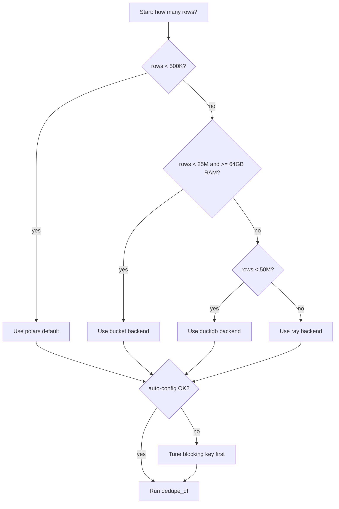

# GoldenMatch scale envelope

How big a dataset can GoldenMatch handle, and which backend should you use?
This page is the single-page answer. It consolidates numbers that were
previously scattered across `packages/python/goldenmatch/CLAUDE.md`,
`CHANGELOG.md`, and `docs/reproducing-benchmarks.md`.

The short version: pick a backend by row count, then make sure your
blocking key behaves. Blocking-key choice dominates wall-clock more than
backend choice does at every scale we have measured.

---

## TL;DR picker (v1.16.0)

| Rows         | Backend             | Notes                                                |
|--------------|---------------------|------------------------------------------------------|
| < 500K       | `polars` (default)  | In-memory. Fastest per record. OOM ceiling near 500K.|
| 500K - 5M (16c / 32+ GB) | **`bucket`** | In-process hash-bucketed scorer. **5M dedupe in 9.94 min / 6.4 GB peak RSS** on a 16c/64GB node. Auto-picked by the v3 planner. PRs #310-#326. |
| 500K - 5M (4c / 16GB)    | `chunked` | Streaming `scan_csv().slice()` + Polars-native cross-chunk join. 5M in ~50 min on `ubuntu-latest` (v1.15). |
| 5M - 25M (16c / 64 GB)   | **`bucket`** (recommended) | Same single-node path scales linearly with memory. **25M dedupe in 6.5 min / 57.7 GB peak RSS** on a 16c/64GB node after the golden-streaming (PR #334) + tracemalloc-drop + UF-state-release (PR #335) fixes. Run 26095134836. |
| 25M - 50M    | `duckdb`            | Out-of-core. Single machine. No OOM ceiling. Slower per record than bucket — picks up where the 64 GB box runs out of headroom. |
| >= 50M       | `ray` (opt-in, not Splink-Spark parity) | Distributed block scoring only — data prep + clustering + golden still run single-node on the driver. v1.16+ requires `GOLDENMATCH_ENABLE_DISTRIBUTED_RAY=1` or explicit `backend="ray"` after the Distributed Plan v1 kill criterion failure (PR #318). See `docs/distributed-ray-roadmap.md` for the 5-phase plan to bring this to Splink-Spark equivalence. |

Switching backend changes the storage and parallelism model. It does not
fix a bad blocking key. See "Block-size failure modes" below.

---

## Decision tree



Per-step detail:

| Node | What to check                                                           |
|------|-------------------------------------------------------------------------|
| B    | Row count of the largest input frame (after column filter).             |
| D    | If you have a Ray cluster handy, jump straight to `ray` at 10M+.        |
| G    | Auto-config emits a postflight health report; check for RED/YELLOW.     |
| I    | Largest block size, cardinality_ratio of the blocking column.           |

---

## Polars in-memory range (default)

The default backend. Polars holds the full frame in RAM and uses
rapidfuzz's GIL-releasing `cdist` for fuzzy scoring through
`ThreadPoolExecutor`.

Measured on a laptop (numbers from `packages/python/goldenmatch/CLAUDE.md`
"Performance" section, last calibrated against v1.2.7):

| Workload                                          | Wall-clock      |
|---------------------------------------------------|-----------------|
| 1M rows, exact dedupe (Polars self-join)          | ~7.8 s          |
| 100K rows, fuzzy dedupe (name + zip), full pipeline | ~12.8 s       |
| 100K rows, fuzzy + exact + golden                 | 7,823 rec/s     |
| 1M rows, fuzzy, in-memory                         | OOMs            |

**Sweet spot:** anything < 500K rows. Use the default.

**Failure mode:** above ~500K rows on a fuzzy run, the in-memory frame
plus the matchkey-side join intermediates push past laptop RAM and you
OOM. The advice in `CLAUDE.md` is explicit: "use DuckDB backend or
chunked processing for >500K records."

**Caveats on the numbers:**

- "7,823 rec/s at 100K" was measured on Ben's dev laptop, not a CI
  reference machine. Treat as order-of-magnitude.
- The throughput number predates the v1.8 introspective controller
  (PR #103-#115). Auto-config is doing more work per run now (profile,
  refit loop, indicator computation), so cold-start adds a fraction of
  a second on small frames. The hot path (scoring + clustering) is
  unchanged.
- These numbers have not been re-measured since v1.2.7. If you need a
  current measurement, run `scripts/run_benchmarks.py` against a real
  dataset and pin the result.

---

## DuckDB backend range

Configure via `backend: { type: duckdb, path: ./my_data.duckdb }`.
Install with `pip install goldenmatch[duckdb]`.

Source: `packages/python/goldenmatch/goldenmatch/backends/duckdb_backend.py`.
The backend reads tables to Polars via Arrow and writes results back.
The user owns the DuckDB file; GoldenMatch does not create schema.

**Sweet spot:** 500K to 50M rows on a single machine.

- DuckDB's columnar/spill-to-disk story means RAM stops being the
  ceiling. The ceiling becomes disk I/O and single-machine CPU.
- Slower per record than Polars in-memory because every read pays an
  Arrow round-trip. The trade-off is "slower, never OOMs."
- No published throughput number for the DuckDB backend specifically.
  The `CHANGELOG` v0.3.0 entry calls it out as "out-of-core processing"
  with no benchmark; no later release re-measured it. **Unverified
  number, not measured since v0.3.0.**

**When to use it:** your laptop OOMs on the in-memory path, or you
already have the data in DuckDB and want to skip the export round-trip.

**Failure mode:** at the upper end (tens of millions of rows) the
single-process scoring loop becomes the bottleneck. That is the
hand-off point to Ray.

---

## Ray backend range

Configure via `backend: ray` or `--backend ray`. Install with
`pip install goldenmatch[ray]`.

Source: `packages/python/goldenmatch/goldenmatch/backends/ray_backend.py`.
`score_blocks_ray` is a drop-in replacement for the
`ThreadPoolExecutor`-based `score_blocks_parallel`. Each block becomes a
Ray remote task; the matchkey config and the frozen `exclude_pairs` set
go through the Ray object store so workers share them zero-copy.

**Sweet spot:** >= 4 large blocks. Below that the code path explicitly
short-circuits back to `score_blocks_parallel`:

```python
# ray_backend.py
if len(blocks) <= 4:
    from goldenmatch.core.scorer import score_blocks_parallel
    return score_blocks_parallel(...)
```

The CHANGELOG v0.7.0 entry advertises "Supports Ray clusters for 50M+
record workloads." That is the design target. Local-mode Ray on a
laptop still works (auto-init uses all CPU cores) but for fewer than
a handful of blocks the ThreadPoolExecutor path will beat it on overhead.

**When to use it:**

- You have a Ray cluster already.
- Your blocking strategy produces many independent blocks (multi-pass
  blocking on a large dataset).
- Single-machine DuckDB has stopped finishing in a workable time.

**Caveat:** no committed benchmark reproduces the 50M+ claim end-to-end.
**Unverified, design-target number.** The mechanism (per-block remote
tasks, object-store sharing) is straightforward; the absence is a
measured wall-clock at that scale.

---

## Fellegi-Sunter (probabilistic) matchkeys at scale

`type: probabilistic` (the EM-trained Fellegi-Sunter matchkey) rides the
**`bucket`** backend's hash-bucketed parallel orchestration — the same path
weighted matchkeys use — so it scales single-node the same way. Two perf
levers are specific to FS:

- **Native FS kernel (opt-in, `GOLDENMATCH_FS_NATIVE=1`).** A Rust per-pair
  scorer (`goldenmatch-native::score_block_pairs_fs`) replaces the numpy NxN
  matrices. Default OFF — FS's discrete comparison levels amplify tiny
  rapidfuzz float differences at exact `partial_threshold` values, so numpy is
  the reproducible default and native is an accept-the-tradeoff speedup.
- **EM trains on a block-stratified sample**, not the full block universe
  (`_sample_blocked_pairs` early-exits) — without that, `train_em` enumerates
  every within-block pair (`O(Σ size_i²)`) and dominates the wall at scale.

### Measured — 6M rows, `backend=bucket`, 16c/64GB (`large-new-64GB`)

Synthetic person data (5M base + 1M injected duplicates, entity-clique ground
truth), `dedupe_df` wall (gen excluded). Both runs produce byte-identical
clusters, so F1 is the same; native only changes the scoring step.

| FS scoring path | Wall | Peak RSS | `bucket_score` | F1 (P/R) |
|---|---|---|---|---|
| numpy (default)            | **288.5 s** | 11.3 GB | 136.6 s | 1.000 (1.000/1.000) |
| native (`FS_NATIVE=1`)     | **162.6 s** | 11.3 GB | **12.7 s** | 1.000 (1.000/1.000) |

The native kernel is **~10.8× on the scoring step** (136.6 s → 12.7 s) — larger
than its DBLP-ACM micro-bench (2.9×) because this shape is 125K tiny blocks
(~48 rows each), exactly where the numpy path's per-block matrix-allocation
overhead dominates and the Rust per-pair loop removes it. By Amdahl the total
is 1.77× (the rest is GoldenCheck scan + clustering + golden, unchanged by the
kernel). Reproduce: `bench-fs-distributed.yml` (`workflow_dispatch`).

Recall the prior, slower figures (numpy 388 s / native 269 s, F1 0.825) were
pre-fix: `train_em` block-pair sampling was un-bounded (PR #803, ~100 s saved
and peak RSS halved) and the bench's F1 was scored against a *star* ground
truth instead of the entity *clique* (PR #802).

---

## Block-size failure modes

The biggest single performance lever is the blocking key. The backends
above all score the same blocks; if your blocks are pathologically
large, no backend saves you.

### Default safety limits

- **`max_block_size: 5000`** in the hand-written `BlockingConfig`
  schema (`packages/python/goldenmatch/goldenmatch/config/schemas.py`).
- **`max_safe_block = 1000`** in auto-config
  (`core/autoconfig.py`). When auto-config builds your blocking config
  it uses 1000, not 5000. The lower cap exists because "blocks larger
  than this cause OOM on ensemble scorers" (verbatim comment in the
  source).
- **`skip_oversized: bool = False`** by default. When `False`,
  oversized blocks log a warning and are scored anyway. When `True`,
  they are either ANN-sub-blocked (if an `ann_column` is configured)
  or skipped entirely.

### Cardinality guards (v1.2.7)

Auto-config has three guards in `core/autoconfig.py` to prevent
common foot-guns:

| Guard                | Threshold              | What it prevents                                       |
|----------------------|------------------------|--------------------------------------------------------|
| Blocking exclusion   | `cardinality_ratio >= 0.95` | Near-unique columns produce single-record blocks. |
| Matchkey exclusion   | `cardinality_ratio < 0.01`  | Too few distinct values to be a useful matchkey.  |
| Null-rate exclusion  | `null_rate > 0.2`           | Sparse columns create huge null-block sinks.      |

### Cluster-size failure mode

Even with safe blocks, oversized clusters can form during scoring
(e.g. through transitive closure). The `cluster_quality: "split"`
value indicates the auto-split path: oversized clusters are split via
MST, and the weakest MST edge is removed to guarantee disconnection.
This is on by default via `GoldenRulesConfig.auto_split = True`.

### The "common email" trap

The `packages/python/goldenmatch/CLAUDE.md` "Common Mistakes" section
calls this out explicitly:

> Using `exact=["email"]` as sole matchkey - creates oversized clusters
> with common emails.

A single shared email (`info@`, `noreply@`, `null`) can pull thousands
of records into one block and one cluster. Symptoms: a giant cluster
in the output, scoring stalls on one block, and (under fuzzy scoring
inside that block) memory pressure on the in-memory backend.

Fix: standardize/strip common patterns at the matchkey step, or add a
second blocking pass so the email block is not the only candidate
source.

---

## Candidate-pair math

Blocking is a partition. If your N rows fall into blocks of sizes
`{n1, n2, ..., nk}`, the total number of candidate pairs you score is:

```
candidate_pairs = sum_i (ni choose 2)
                = sum_i ni * (ni - 1) / 2
```

This is why blocking-key cardinality matters more than dataset size.
A 1M-row dataset blocked on a uniform key with 10K distinct values
yields blocks of ~100 each, and roughly:

```
10_000 * (100 * 99 / 2) = 49_500_000 pairs
```

That same dataset blocked on a poor key (say, 50 distinct city values)
yields blocks of ~20,000 each:

```
50 * (20_000 * 19_999 / 2) = 9_999_500_000 pairs
```

200x more pairs to score for the same dataset, on the same backend.
This is why the cardinality guards exist and why `max_block_size`
defaults so low under auto-config.

**Rule of thumb:** the cardinality_ratio guards (`< 0.01` skip for
matchkey, `>= 0.95` skip for blocking) keep blocks in a band where
candidate pairs scale with N rather than N^2. If you find yourself
configuring blocking by hand, check the resulting block-size
distribution before running on the full dataset.

---

## Quick checklist

Before scaling up, in order:

1. **Profile your blocking key.** What is the cardinality_ratio? What
   is the largest block? Auto-config will print this in the postflight
   health report (`result.postflight_report`).
2. **Stay under `max_block_size=1000` for auto-config**, or
   `max_block_size=5000` for hand-written configs.
3. **Pick the backend from the row count**, not from intuition. < 500K
   stays on Polars; > 500K crosses to DuckDB; > 50M or many-large-blocks
   crosses to Ray.
4. **Re-measure if you care about exact numbers.** The throughput
   numbers in this doc were calibrated against v1.2.7 and have not
   been re-run on v1.12. The `scripts/run_benchmarks.py` runner is the
   path to a current measurement (see
   [`docs/reproducing-benchmarks.md`](reproducing-benchmarks.md)).

---

## Where the numbers come from

- Polars throughput, 1M exact, 100K fuzzy: `packages/python/goldenmatch/CLAUDE.md`
  "Performance" section. Last calibrated against v1.2.7.
- DuckDB backend role and out-of-core framing: `CHANGELOG.md` v0.3.0,
  `goldenmatch/backends/duckdb_backend.py` module docstring. No
  committed throughput benchmark.
- Ray backend role and 50M+ design target: `CHANGELOG.md` v0.7.0,
  `goldenmatch/backends/ray_backend.py` source. The <=4-block fallback
  is enforced in code.
- Block-size and cardinality guards: `core/autoconfig.py` and
  `config/schemas.py` (`max_block_size`, `skip_oversized`,
  `max_safe_block = 1000`, cardinality_ratio thresholds 0.01 / 0.95).
- "Common email" trap: `packages/python/goldenmatch/CLAUDE.md`
  "Common Mistakes" section.
- Cluster auto-split: `GoldenRulesConfig.auto_split` in
  `config/schemas.py`, `cluster_quality: "split"` field on
  `build_clusters` output.
