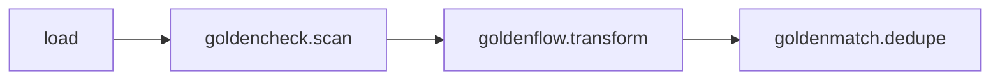

# goldenpipe

Golden Suite orchestrator for TypeScript — chains **GoldenCheck → GoldenFlow → GoldenMatch** into one adaptive, pluggable pipeline. TypeScript port of the [`goldenpipe`](https://github.com/benseverndev-oss/goldenmatch/tree/main/packages/python/goldenpipe) Python library.

It composes the edge-safe cores of the three sibling packages:

- [`goldencheck`](https://www.npmjs.com/package/goldencheck) — data-quality scan (`scanData`)
- [`goldenflow`](https://www.npmjs.com/package/goldenflow) — transforms / standardization (`TransformEngine`)
- [`goldenmatch`](https://www.npmjs.com/package/goldenmatch) — dedupe / entity resolution (`dedupe`)

Data flows through the pipeline as `Row[]` (arrays of plain objects).

## Install

```bash
npm install goldenpipe
# the three siblings come along as dependencies
```

`yaml` is an optional peer dependency, needed only for YAML config loading:

```bash
npm install yaml
```

## Quick start

```ts
import { runDf } from "goldenpipe";

const rows = [
  { first_name: "John", last_name: "Smith", email: "john@example.com" },
  { first_name: "Jon",  last_name: "Smith", email: "john@example.com" },
  { first_name: "Jane", last_name: "Doe",   email: "jane@example.com" },
];

// Zero-config: runs goldencheck.scan -> goldenflow.transform -> goldenmatch.dedupe
const result = await runDf(rows);

console.log(result.status);          // "success"
console.log(result.inputRows);       // 3
console.log(result.artifacts.golden); // golden (canonical) records
console.log(result.artifacts.unique); // distinct records
```

> **Async:** the runner is async because GoldenMatch's `dedupe` is async. `runDf`, `runStages`, `Pipeline.run`, and the node `run(source)` all return promises.

### From a CSV file (Node)

```ts
import { run } from "goldenpipe/node";

const result = await run("people.csv");          // zero-config
const result2 = await run("people.csv", { config: "pipeline.yml" });
```

### Custom pipeline config

```ts
import { runDf, makePipelineConfig, makeStageSpec } from "goldenpipe";

const config = makePipelineConfig({
  pipeline: "check-and-dedupe",
  stages: [
    "goldencheck.scan",
    makeStageSpec({ use: "goldenmatch.dedupe", config: { threshold: 0.9 } }),
    // omit goldenflow.transform to skip transformation
  ],
});

const result = await runDf(rows, config);
```

### Programmatic stages

```ts
import { runStages, stage, StageStatus } from "goldenpipe";

const myStage = stage(
  { name: "tagger", produces: ["tag"], consumes: ["df"] },
  (ctx) => {
    ctx.artifacts.tag = (ctx.df ?? []).length;
    return { status: StageStatus.SUCCESS };
  },
);

const result = await runStages([myStage], rows);
```

## CLI

```bash
goldenpipe-js run people.csv [-c pipeline.yml] [-v]   # run the chain on a CSV
goldenpipe-js stages                                  # list registered stages
goldenpipe-js validate -c pipeline.yml                # dry-run wiring validation
goldenpipe-js init [-d .]                             # scaffold a goldenpipe.yml
goldenpipe-js mcp-serve                               # run the MCP server (stdio)
goldenpipe-js agent-serve [-p 8250]                   # run the A2A agent server (HTTP)
goldenpipe-js serve [-p 8000]                         # run the REST API server (HTTP)
```

## Servers (MCP / A2A / REST)

GoldenPipe ships three server surfaces, each exposing the same 4 operations as
the Python sibling — `list_stages`, `validate_pipeline`, `run_pipeline`,
`explain_pipeline`:

- **MCP** (stdio, JSON-RPC 2.0): `goldenpipe-js mcp-serve` or the `goldenpipe-mcp` bin.
- **A2A** (HTTP, port 8250): `goldenpipe-js agent-serve` — agent card at `/.well-known/agent.json`, skill dispatch at `POST /tasks`.
- **REST** (HTTP, port 8000): `goldenpipe-js serve` — `GET /stages`, `POST /validate`, `POST /run`.

Wire the MCP server into a client (e.g. Claude Desktop):

```json
{ "mcpServers": { "goldenpipe": { "command": "goldenpipe-mcp" } } }
```

## Architecture



| Stage | Wraps | Produces |
|-------|-------|----------|
| `load` | built-in | `df` |
| `goldencheck.scan` | `scanData(TabularData)` | `findings`, `profile`, `column_contexts` |
| `goldenflow.transform` | `new TransformEngine(cfg).transformDf(rows)` | `df`, `manifest` |
| `goldenmatch.dedupe` | `await dedupe(rows, { config })` | `clusters`, `golden`, `unique`, `dupes`, `match_stats`, `scored_pairs` |

The engine layer mirrors the Python design:

- **registry** — a STATIC registry (`buildDefaultRegistry()`) replacing Python's entry-point discovery.
- **resolver** — builds an `ExecutionPlan` via a dependency-DAG planner: auto-prepends `load`, activates each stage's `needs`, and reorders minimally (a consumer listed before its sole producer resolves instead of erroring) while keeping config order everywhere else. It rejects the failure classes the old linear check hid — `MissingProducer`, `AmbiguousProducer` (two producers a consumer can't disambiguate), `Cycle`, `UnknownNeed`.
- **router** — applies a stage's `Decision` (skip / insert / abort) to the remaining plan.
- **runner** — async stage execution with per-stage error handling + `skipIf` gating.
- **reporter** — assembles the `PipeResult` (status, stages, artifacts, errors, reasoning, timing).

A **column-context pipeline** carries semantic metadata across stages: GoldenCheck builds `ColumnContext`s (name-regex classification + IQR cardinality banding + identifier inference), GoldenFlow enriches them (date transforms confirm date type), and GoldenMatch consumes them to build a targeted dedupe config (`buildConfigFromContexts`) instead of re-profiling.

## Decisions (adaptive routing)

`severityGate`, `piiRouter`, and `rowCountGate` are ported. They are not wired into the default chain — add them to a custom runner / stage that returns their `Decision`.

> **TS sibling skew:** GoldenCheck-JS `Finding.severity` is a numeric enum (INFO/WARNING/ERROR) with no `"critical"` level, and there is no `"pii_detection"` check. So `severityGate` and `piiRouter` are effectively no-ops against current GoldenCheck-JS output — they exist for structural parity and so custom stages emitting those findings still route.

## Deferred (not in this v1 port)

- **`identity_resolve` stage** — GoldenMatch-JS Identity Graph wiring through the pipeline. The edge-safe `InMemoryIdentityStore` exists in `goldenmatch`, but the pipeline-driven `resolveClusters` population is not yet exposed.
- **Textual TUI** — the Python Textual TUI is not ported. (The MCP, A2A, and REST servers **are** ported — see above.)

> **`infer_schema` is now ported** — InferMap-based domain detection + schema mapping runs as an opt-in TS stage (`infer_schema`, registered but not in the default stage order, matching Python). It produces the shared `inferred_schema` artifact and, because it calls the InferMap scorers, inherits their Rust-kernel WASM path when `enableInfermapWasm()` is active.

### Sibling version-skew artifacts

The TS siblings are version-skewed from the Python ones, so some artifacts the Python pipeline surfaces are shaped differently or absent here:

- `golden` artifact maps to GoldenMatch-JS `DedupeResult.goldenRecords` (the Python sibling exposes `.golden`).
- `scored_pairs` is GoldenMatch-JS `result.scoredPairs` (camelCase).
- `matchkey_used` is derived from the *built config's* first matchkey — the JS `DedupeResult` does not carry the resolved matchkey list back (the Python result does after auto-config).
- The Python `goldencheck.scan` adapter calls `scan_file(path)`, so the in-memory `run_df` path fails that stage. GoldenCheck-JS's `scanData` operates on rows, so the TS adapter's scan **succeeds** in both the in-memory (`runDf`) and file (`run`) paths.

## Cross-language parity

`tests/parity/pipe-parity.test.ts` asserts skew-robust invariants (`status`, `input_rows`, ordered per-stage status/skip sequence, final `golden`/`unique` counts) against Python-generated goldens in `tests/fixtures/pipe_parity.json`. Regenerate the goldens with:

```bash
uv run --project packages/python/goldenpipe python \
  packages/python/goldenpipe/scripts/emit_ts_parity_fixtures.py
```

### Planner: one Rust source of truth (opt-in WASM)

The pipeline **planner** — dependency-DAG stage ordering (`needs` + minimal
reorder) and wiring validation, decision routing, auto-config, and the `skip_if`
predicate — is extracted into the pyo3-free Rust `goldenpipe-core` crate, the
single reference every surface computes identically. The resolver activates each
stage's `needs`, reorders a consumer ahead of its sole producer instead of
erroring, and rejects genuinely ambiguous co-production / cycles / unknown `needs`
as typed errors. Pure-TS is a proven-conforming fallback and the default: a CI
parity gate replays the same golden vectors through pure-TS **and** the WASM
kernel, both asserted byte-identical to `goldenpipe-core`, so the TS and Python
planners cannot drift.

The WASM path is opt-in — pure-TS needs no build step and stays the edge-safe
default:

```ts
import { enableWasm } from "goldenpipe/core";

await enableWasm(); // planner now routes through goldenpipe-core (wasm); pure-TS otherwise
```

`enableWasm()` is async and idempotent; on failure pure-TS stays active (pass
`{ require: true }` to throw instead). Only the pure *planner* is served from Rust
— stage execution, IO, and adapters stay a per-language host (orchestration is
boundary-bound, so there is no compute win to move it). This does not change the
runtime-artifact skew noted above; it locks the *planning* decisions.

## License

MIT
